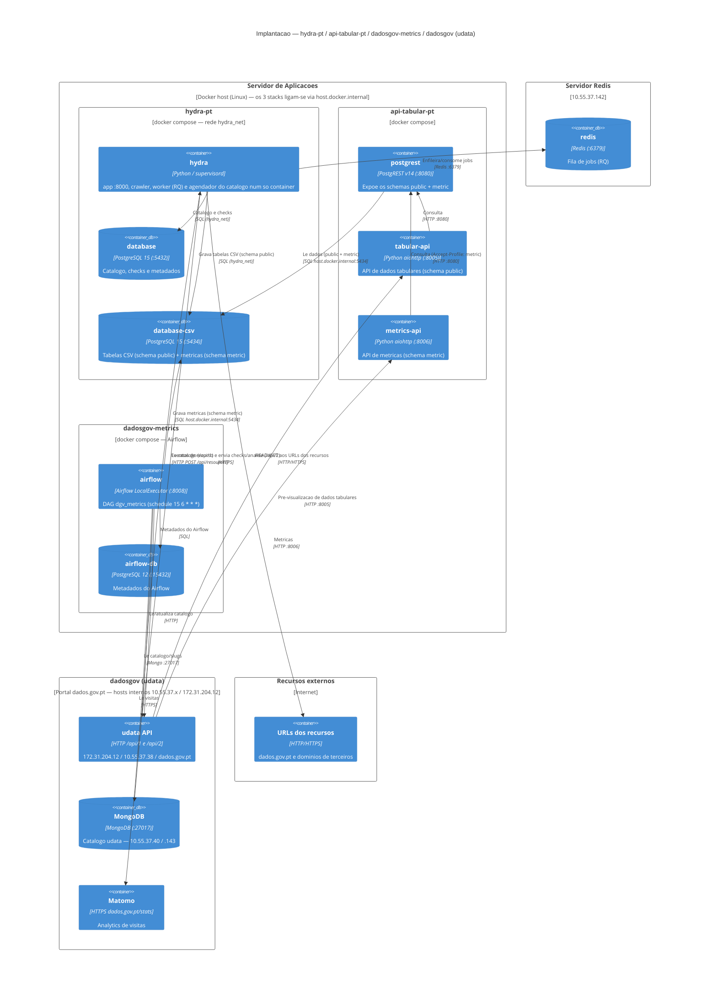

# Diagrama de Implantação (C4) — dados.gov.pt

Vista de **implantação** (deployment) do C4 Model das ligações entre os serviços
**hydra-pt**, **api-tabular-pt**, **dadosgov-metrics** e **dadosgov (udata)**.

> Nota C4: a *Deployment view* é a vista suplementar que mapeia os containers em
> nós de infraestrutura. (No C4 clássico o "Nível 4" é o de *Código*; o que se
> pretende aqui é o diagrama de implantação com as ligações entre serviços.)



## Legenda das ligações

| # | Origem | Destino | Protocolo / porta | Propósito |
|---|--------|---------|-------------------|-----------|
| 1 | hydra (crawler/worker) | udata API | HTTPS `/api/1`, `/api/2` | Lê o catálogo e envia resultados de check/análise (`CATALOG_URL`, `UDATA_URI`). |
| 2 | udata API | hydra (app) | HTTP `POST /api/resources` | Eventos de criação/alteração de recurso (prioriza crawl). |
| 3 | hydra (crawler) | Recursos externos | HTTP/HTTPS | HEAD/GET aos URLs dos recursos do catálogo (dados.gov.pt e terceiros). |
| 4 | hydra (crawler/worker) | Redis | Redis `:6379` | Fila de jobs RQ (`10.55.37.142`). |
| 5 | hydra | database (`:5432`) | SQL (rede `hydra_net`) | Catálogo, checks, metadados. |
| 6 | hydra (worker) | database-csv (`:5434`) | SQL (rede `hydra_net`) | Grava tabelas convertidas de CSV (schema `public`). |
| 7 | postgrest | database-csv | SQL `host.docker.internal:5434` | Lê `public` (tabular) e `metric` (métricas). |
| 8 | tabular-api | postgrest | HTTP `:8080` | Serve dados tabulares. |
| 9 | metrics-api | postgrest | HTTP `:8080` | Serve métricas (schema `metric` via `Accept-Profile`). |
| 10 | udata (frontend/API) | tabular-api (`:8005`) | HTTP | Pré-visualização de dados tabulares. |
| 11 | udata (frontend/API) | metrics-api (`:8006`) | HTTP | Consumo de métricas. |
| 12 | airflow (DAG) | Matomo | HTTPS | Lê visitas (`dados.gov.pt/stats`). |
| 13 | airflow (DAG) | MongoDB udata | Mongo `:27017` | Resolve slugs→ObjectId e lê catálogo. |
| 14 | airflow (DAG) | udata API | HTTP | Lê/atualiza catálogo (`UDATA_INSTANCE_URL`). |
| 15 | airflow (DAG) | database-csv | SQL `host.docker.internal:5434` | Grava métricas no schema `metric`. |
| 16 | airflow | airflow-db (`:15432`) | SQL | Metadados do próprio Airflow (PostgreSQL 12). |

## O elo central

A **`database-csv` do hydra-pt (porta 5434)** é o ponto de integração dos quatro sistemas:

```
hydra worker  ──(escreve schema public)──▶  database-csv  ◀──(escreve schema metric)── dadosgov-metrics
                                                 │
                                            (lê ambos)
                                                 ▼
                                            PostgREST ──▶ tabular-api / metrics-api ──▶ dadosgov (udata)
```

## Endpoints observados (variam por ambiente)

| Serviço | Endereços observados nos configs |
|---|---|
| udata API | `172.31.204.12` (hydra `UDATA_URI`, metrics `.env`), `10.55.37.38` (metrics `variables.json`), `dados.gov.pt` (catálogo público) |
| MongoDB udata | `10.55.37.40` (`connections.json`), `10.55.37.143` (`.env` / script Matomo) |
| Redis | `10.55.37.142:6379` |
| Matomo | `https://dados.gov.pt/stats` |

## Notas

- Os 3 stacks Docker (**hydra-pt**, **api-tabular-pt**, **dadosgov-metrics**) correm no **mesmo host**; api-tabular e metrics chegam à BD do hydra por `host.docker.internal:5434` (porta publicada), enquanto o próprio hydra usa a rede interna `hydra_net` (`database-csv:5432`).
- O código dos DAGs do `dadosgov-metrics` provém do repositório `datagouvfr_data_pipelines` (montado no container Airflow) — é dependência de código, não um serviço em runtime, por isso não aparece no diagrama.
- Os IPs internos diferem entre ambientes (local/distribuído); ver a tabela acima e o `setup.py` (topologia).
